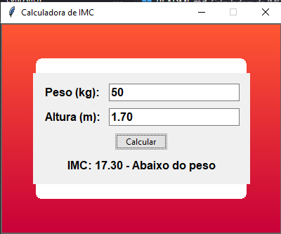

# Calculadora de IMC (Índice de Massa Corporal)

Este é um projeto de uma aplicação gráfica para calcular o IMC (Índice de Massa Corporal) a partir do peso e altura do usuário, desenvolvido em Python usando a biblioteca `tkinter`.

## Funcionalidades

- Calcula o IMC com base no peso e altura do usuário.
- Fornece uma classificação do IMC (Abaixo do peso, Peso normal, Sobrepeso, Obesidade).
- Interface gráfica amigável com fundo gradiente e bordas arredondadas.

## Como Usar

1. Clone este repositório para o seu ambiente local:
    ```bash
    git clone https://github.com/seu-usuario/calculadora-de-imc.git
    ```

2. Navegue até o diretório do projeto:
    ```bash
    cd calculadora-de-imc
    ```

3. Execute o script principal para iniciar a aplicação:
    ```bash
    python imc.py
    ```

4. Na interface gráfica, digite seu peso no campo de entrada "Peso (kg)".
5. Digite sua altura no campo de entrada "Altura (m)".
6. Clique no botão "Calcular" para ver o resultado do cálculo do IMC e a classificação.

## Requisitos

- Python 3.x
- Biblioteca `tkinter` (geralmente incluída na instalação padrão do Python)

## Exemplo de Uso



## Licença

Este projeto está licenciado sob a licença MIT. Veja o arquivo `LICENSE` para mais detalhes.