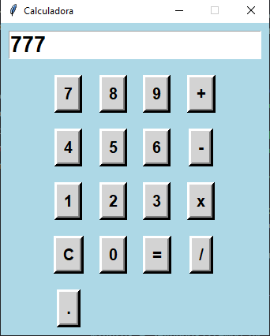

# Calculadora Simples em Python

Este é um projeto de uma calculadora simples com interface gráfica desenvolvida em Python usando a biblioteca `tkinter`.

## Funcionalidades

- Adição, subtração, multiplicação e divisão.
- Suporte para números decimais.
- Botão de limpar (C) para resetar a entrada.
- Verificação para evitar operações duplicadas (por exemplo, `++`, `--`, etc.).

## Como Usar

1. Clone este repositório para o seu ambiente local:

   ```bash
   git clone https://github.com/seu-usuario/calculadora-python.git
   ```

2. Navegue até o diretório do projeto:

   ```bash
   cd calculadora-python
   ```

3. Execute o script Python:

   ```bash
   python calculadora.py
   ```

   ## Exemplo de Uso

   

## Dependências

- Python 3.x
- [tkinter](http://_vscodecontentref_/0) (geralmente incluído na instalação padrão do Python)
