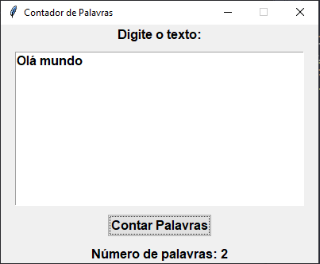

# Contador de Palavras

Este é um projeto de uma aplicação gráfica para contar o número de palavras em um texto, desenvolvida em Python usando a biblioteca `tkinter`.

## Funcionalidades

- Conta o número de palavras em um texto inserido pelo usuário.
- Interface gráfica amigável com um botão estilizado.
- O botão muda de cor quando o mouse passa sobre ele.

## Como Usar

1. Clone este repositório para o seu ambiente local:
    ```bash
    git clone https://github.com/seu-usuario/contador-de-palavras.git
    ```

2. Navegue até o diretório do projeto:
    ```bash
    cd contador-de-palavras
    ```

3. Execute o script principal para iniciar a aplicação:
    ```bash
    python contadordepalavras.py
    ```

4. Na interface gráfica, digite o texto no campo de entrada.
5. Clique no botão "Contar Palavras" para ver o número de palavras no texto.

## Requisitos

- Python 3.x
- Biblioteca `tkinter` (geralmente incluída na instalação padrão do Python)

## Exemplo de Uso



## Contribuições

Contribuições são bem-vindas! Sinta-se à vontade para abrir uma issue ou enviar um pull request.

## Licença

Este projeto está licenciado sob a licença MIT. Veja o arquivo `LICENSE` para mais detalhes.