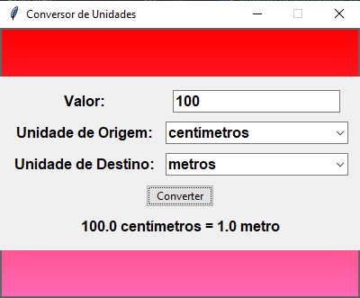

# Conversor de Unidades

Este é um projeto de uma aplicação gráfica para converter diferentes unidades de medida, como metros para quilômetros, gramas para quilos, etc., desenvolvido em Python usando a biblioteca `tkinter`.

## Funcionalidades

- Converte valores entre diferentes unidades de medida.
- Interface gráfica amigável com fundo gradiente vermelho e rosa.
- Exibe a unidade de medida de forma singular ou plural, dependendo do valor.

## Como Usar

1. Clone este repositório para o seu ambiente local:
    ```bash
    git clone https://github.com/seu-usuario/conversor-de-unidades.git
    ```

2. Navegue até o diretório do projeto:
    ```bash
    cd conversor-de-unidades
    ```

3. Execute o script principal para iniciar a aplicação:
    ```bash
    python conversordemedidas.py
    ```

4. Na interface gráfica, digite o valor a ser convertido no campo de entrada.
5. Selecione a unidade de origem e a unidade de destino nos menus suspensos.
6. Clique no botão "Converter" para ver o resultado.

## Requisitos

- Python 3.x
- Biblioteca `tkinter` (geralmente incluída na instalação padrão do Python)

## Exemplo de Uso



## Contribuições

Contribuições são bem-vindas! Sinta-se à vontade para abrir uma issue ou enviar um pull request.

## Licença

Este projeto está licenciado sob a licença MIT. Veja o arquivo `LICENSE` para mais detalhes.