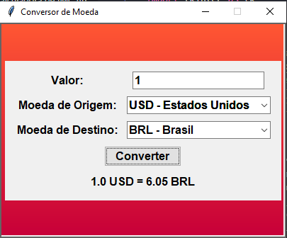

# Conversor de Moeda

Este é um projeto de uma aplicação gráfica para converter valores entre diferentes moedas, desenvolvida em Python usando a biblioteca `tkinter`.

## Funcionalidades

- Converte valores entre diferentes moedas usando taxas de câmbio atualizadas.
- Interface gráfica amigável com fundo em gradiente de cores (laranja e vermelho).
- Exibe o nome do país que mais usa cada moeda na frente de cada moeda.
- Fonte estilizada para uma melhor experiência visual.

## Como Usar

1. Clone este repositório para o seu ambiente local:
    ```bash
    git clone https://github.com/seu-usuario/conversor-de-moeda.git
    ```

2. Navegue até o diretório do projeto:
    ```bash
    cd conversor-de-moeda
    ```

3. Instale as dependências necessárias:
    ```bash
    pip install requests
    ```

4. Execute o script principal para iniciar a aplicação:
    ```bash
    python conversodemoeda.py
    ```

5. Na interface gráfica, digite o valor a ser convertido no campo de entrada.
6. Selecione a moeda de origem e a moeda de destino nos menus suspensos.
7. Clique no botão "Converter" para ver o resultado.

## Requisitos

- Python 3.x
- Biblioteca `requests` (pode ser instalada com `pip install requests`)
- Biblioteca `tkinter` (geralmente incluída na instalação padrão do Python)

## Exemplo de Uso



## Contribuições

Contribuições são bem-vindas! Sinta-se à vontade para abrir uma issue ou enviar um pull request.

## Licença

Este projeto está licenciado sob a licença MIT. Veja o arquivo `LICENSE` para mais detalhes.