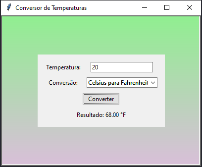

# Conversor de Temperaturas

Este é um projeto de uma aplicação gráfica para converter temperaturas entre Celsius, Fahrenheit e Kelvin, desenvolvida em Python usando a biblioteca `tkinter`.

## Funcionalidades

- Converte temperaturas entre Celsius, Fahrenheit e Kelvin.
- Interface gráfica amigável com fundo em gradiente de cores (azul, verde e roxo claro).
- Exibe mensagens de erro para entradas inválidas.

## Como Usar

1. Clone este repositório para o seu ambiente local:
    ```bash
    git clone https://github.com/seu-usuario/conversor-de-temperaturas.git
    ```

2. Navegue até o diretório do projeto:
    ```bash
    cd conversor-de-temperaturas
    ```

3. Execute o script principal para iniciar a aplicação:
    ```bash
    python conversor.py
    ```

4. Na interface gráfica, insira a temperatura que deseja converter.
5. Selecione o tipo de conversão desejada no menu suspenso.
6. Clique no botão "Converter" para ver o resultado.

## Requisitos

- Python 3.x
- Biblioteca [tkinter](http://_vscodecontentref_/1) (geralmente incluída na instalação padrão do Python)

## Exemplo de Uso



## Contribuições

Contribuições são bem-vindas! Sinta-se à vontade para abrir uma issue ou enviar um pull request.

## Licença

Este projeto está licenciado sob a licença MIT. Veja o arquivo `LICENSE` para mais detalhes.