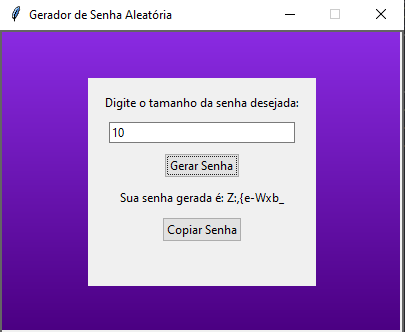

# Gerador de Senha Aleatória

Este é um projeto de uma aplicação gráfica para gerar senhas aleatórias seguras, desenvolvida em Python usando a biblioteca `tkinter`.

## Funcionalidades

- Gera senhas aleatórias de um comprimento especificado pelo usuário.
- Interface gráfica amigável com fundo em gradiente de cores (roxo e azul).
- Permite copiar a senha gerada para a área de transferência com um clique.

## Como Usar

1. Clone este repositório para o seu ambiente local:
    ```bash
    git clone https://github.com/seu-usuario/gerador-de-senha.git
    ```

2. Navegue até o diretório do projeto:
    ```bash
    cd gerador-de-senha
    ```

3. Execute o script principal para iniciar a aplicação:
    ```bash
    python geradordesenha.py
    ```

4. Na interface gráfica, digite o tamanho da senha desejada no campo de entrada.
5. Clique no botão "Gerar Senha" para gerar a senha.
6. Clique no botão "Copiar Senha" para copiar a senha gerada para a área de transferência.

## Requisitos

- Python 3.x
- Biblioteca `tkinter` (geralmente incluída na instalação padrão do Python)

## Exemplo de Uso



## Contribuições

Contribuições são bem-vindas! Sinta-se à vontade para abrir uma issue ou enviar um pull request.

## Licença

Este projeto está licenciado sob a licença MIT. Veja o arquivo `LICENSE` para mais detalhes.