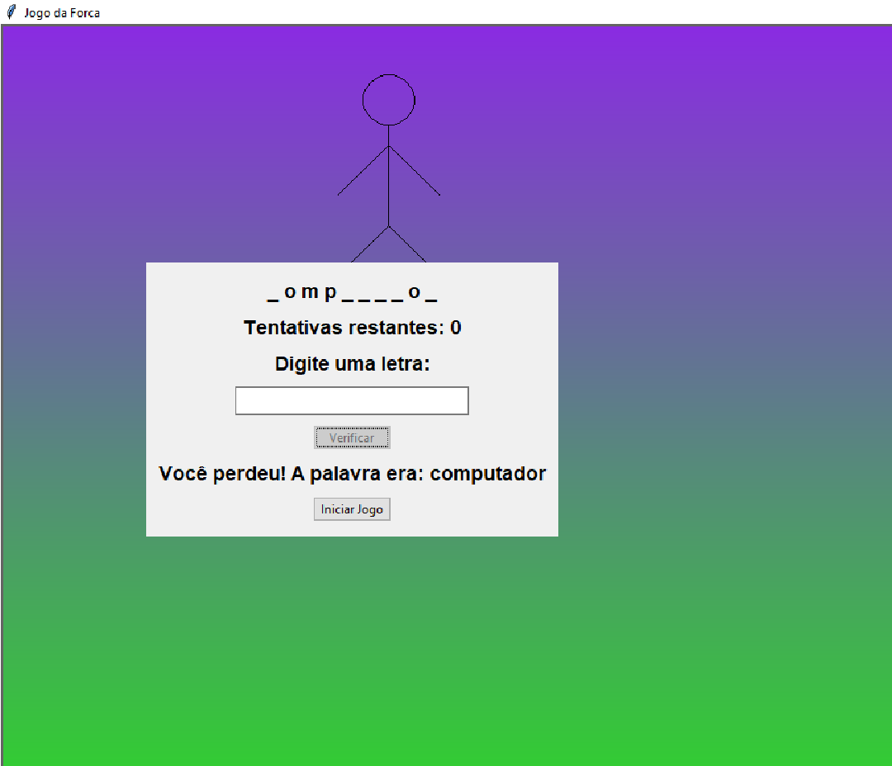

# Jogo da Forca

Este é um projeto de uma aplicação gráfica para o jogo da forca, desenvolvido em Python usando a biblioteca `tkinter`.

## Funcionalidades

- Permite ao usuário adivinhar uma palavra letra por letra.
- Exibe um boneco de palito que é desenhado conforme o usuário erra as tentativas.
- Interface gráfica amigável com fundo gradiente roxo e verde.
- Permite reiniciar o jogo a qualquer momento.

## Como Usar

1. Clone este repositório para o seu ambiente local:
    ```bash
    git clone https://github.com/seu-usuario/jogo-da-forca.git
    ```

2. Navegue até o diretório do projeto:
    ```bash
    cd jogo-da-forca
    ```

3. Execute o script principal para iniciar a aplicação:
    ```bash
    python jogodaforca.py
    ```

4. Na interface gráfica, digite uma letra no campo de entrada e clique no botão "Verificar" para adivinhar a letra.
5. O boneco de palito será desenhado conforme você errar as tentativas.
6. Clique no botão "Iniciar Jogo" para reiniciar o jogo a qualquer momento.

## Requisitos

- Python 3.x
- Biblioteca `tkinter` (geralmente incluída na instalação padrão do Python)

## Exemplo de Uso



## Contribuições

Contribuições são bem-vindas! Sinta-se à vontade para abrir uma issue ou enviar um pull request.

## Licença

Este projeto está licenciado sob a licença MIT. Veja o arquivo `LICENSE` para mais detalhes.