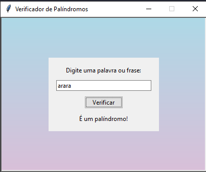

# Verificador de Palíndromos

Este é um projeto de uma aplicação gráfica para verificar se uma palavra ou frase é um palíndromo (lê-se da mesma forma de trás para frente), desenvolvida em Python usando a biblioteca `tkinter`.

## Funcionalidades

- Verifica se uma palavra ou frase é um palíndromo.
- Ignora espaços, pontuações e diferenças entre maiúsculas e minúsculas.
- Interface gráfica amigável com fundo em gradiente de cores (azul e roxo claro).
- Exibe o resultado diretamente na tela principal.

## Como Usar

1. Clone este repositório para o seu ambiente local:
    ```bash
    git clone https://github.com/seu-usuario/verificador-de-palindromos.git
    ```

2. Navegue até o diretório do projeto:
    ```bash
    cd verificador-de-palindromos
    ```

3. Execute o script principal para iniciar a aplicação:
    ```bash
    python verifipali.py
    ```

4. Na interface gráfica, digite uma palavra ou frase no campo de entrada.
5. Clique no botão "Verificar" para ver o resultado.

## Requisitos

- Python 3.x
- Biblioteca `tkinter` (geralmente incluída na instalação padrão do Python)

## Exemplo de Uso



## Contribuições

Contribuições são bem-vindas! Sinta-se à vontade para abrir uma issue ou enviar um pull request.

## Licença

Este projeto está licenciado sob a licença MIT. Veja o arquivo `LICENSE` para mais detalhes.